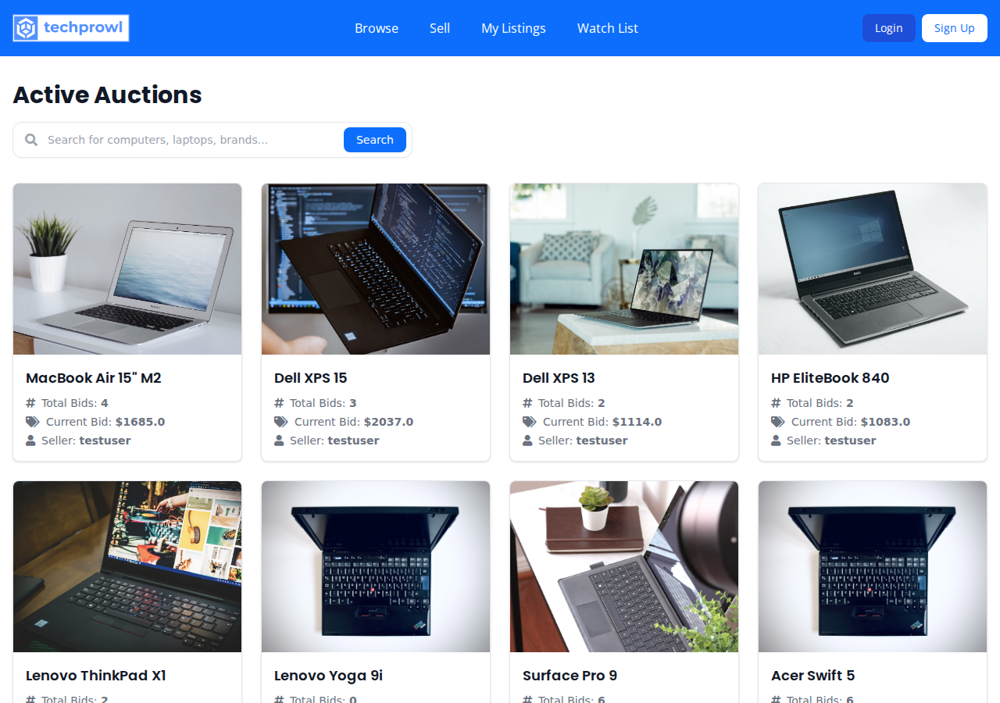
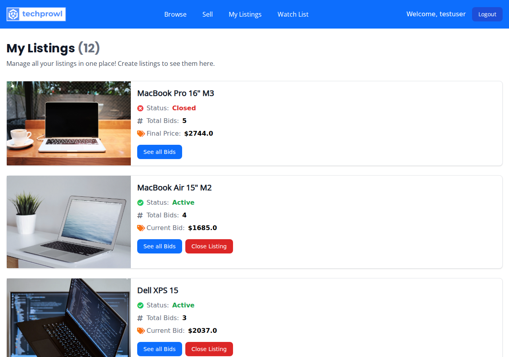
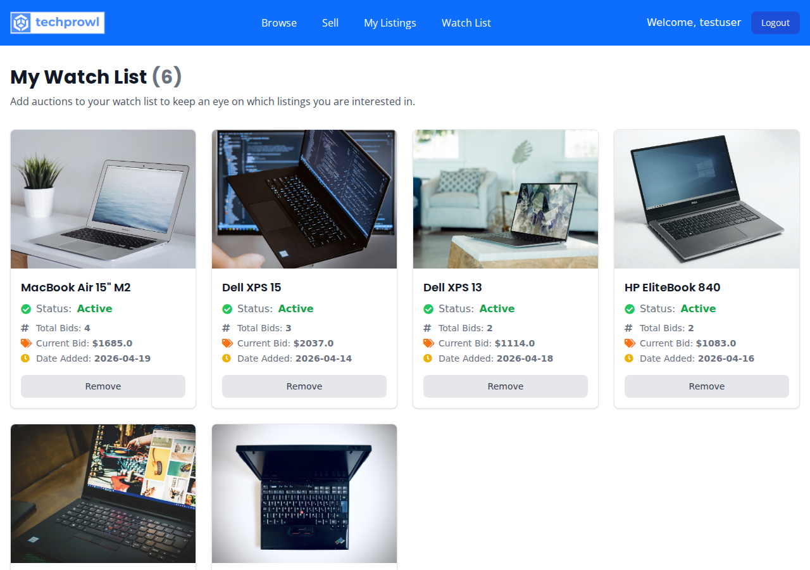
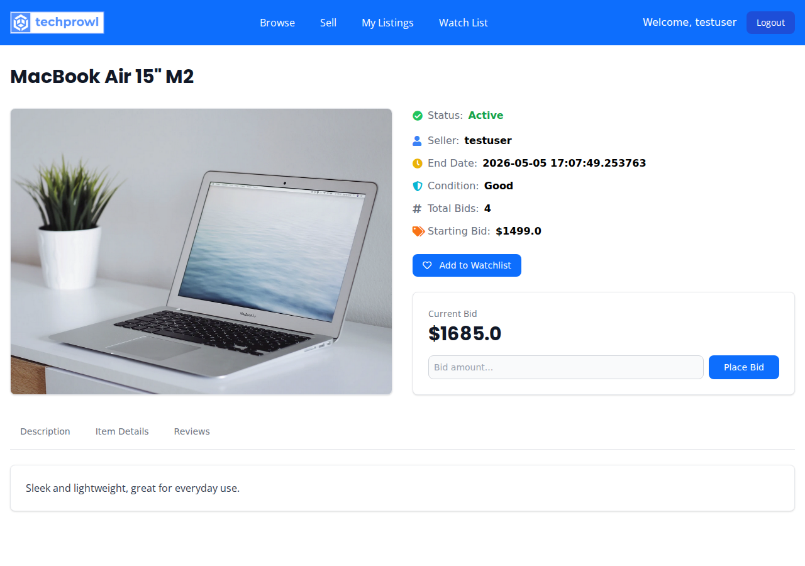
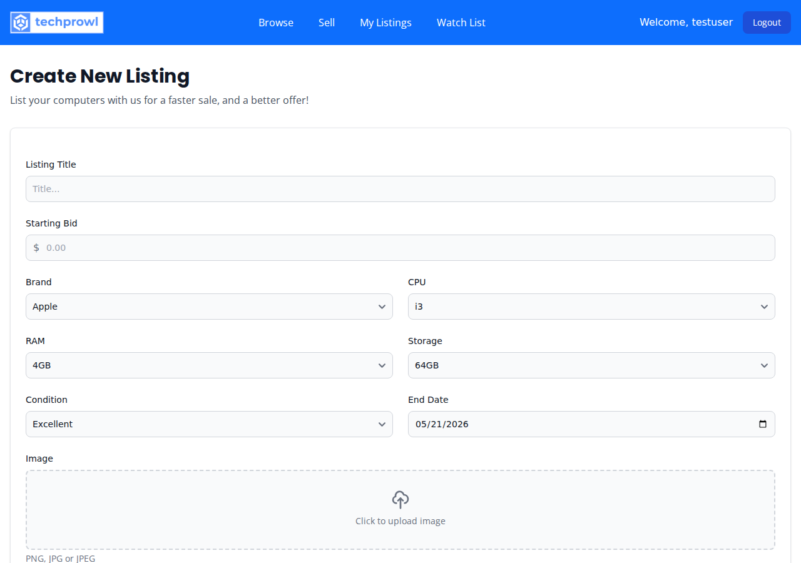
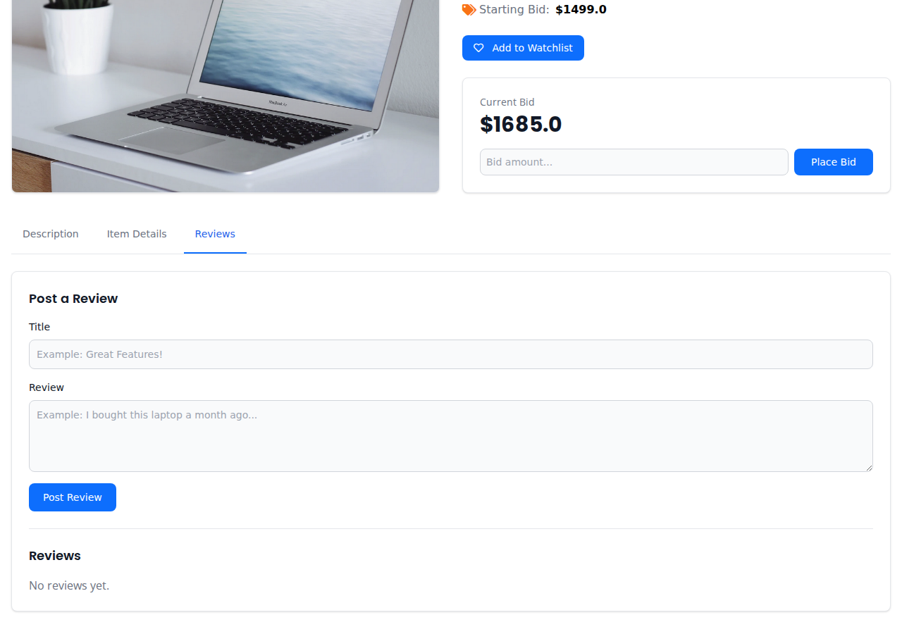

# Computer Auction Website

A website for auctioning computers.

## Screenshots

<table>
  <tr>
    <td><br><center>Homepage</center></td>
    <td><br><center>My Listings</center></td>
  </tr>
  <tr>
    <td><br><center>Watchlist</center></td>
    <td><br><center>Listing Detail</center></td>
  </tr>
  <tr>
    <td><br><center>Create Listing</center></td>
    <td><br><center>Listing Reviews</center></td>
  </tr>
</table>

## Technologies Used
- HTML
- CSS
- Tailwind + Flowbite
- Python
- Flask
  - Flask Templates
  - Flask WTForms
  - Flask SQLAlchemy
  - Flask Login

## Getting Started

### Prerequisites

- Python 3.8+
- pip

### Installation

1. Clone the repository:
```bash
git clone <repository-url>
cd computer-auction
```

2. Copy the environment file:
```bash
cp .env.example .env
```

3. Install dependencies:
```bash
pip install -r requirements.txt
```

4. Run the application:
```bash
python main.py
```

5. Open your browser and navigate to `http://localhost:5000`

The database (`auction/auction.sqlite`) is included with seed data.

To re-seed the database:
```bash
python seed_db.py
```

To update screenshots:
```bash
pip install playwright
playwright install chromium
python screenshot_script.py
```

## Features

### User Authentication
- User registration with email validation
- Secure login/logout
- Session management

### Listings
- Create new auction listings with title, description, starting price, and images
- View all active listings on the homepage
- View listing details including bid history
- See listing status (Active/Closed)

### Bidding
- Place bids on active listings
- Bid must be higher than current highest bid
- View bid history for each listing
- Automatic auction closure based on end date

### Watchlist
- Add/remove listings from personal watchlist
- View all watched items in one place

### Additional
- Search listings by keyword
- Post reviews on listings
- Responsive design for mobile and desktop
- Custom error pages (404, 500)
- Form validation

## Project Structure

```
computer-auction/
├── auction/
│   ├── __init__.py          # Flask app factory
│   ├── auth.py              # Authentication routes
│   ├── forms.py             # WTForms definitions
│   ├── listings.py          # Listing/bid/watchlist logic
│   ├── models.py            # Database models
│   ├── views.py             # Main routes
│   ├── auction.sqlite      # SQLite database
│   ├── static/              # CSS, images
│   └── templates/           # Jinja2 templates
├── main.py                  # Application entry point
├── requirements.txt         # Python dependencies
└── README.md
```
